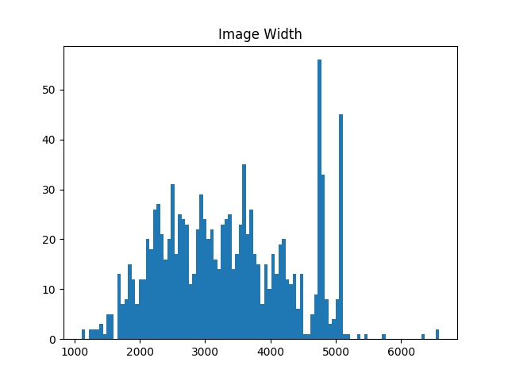
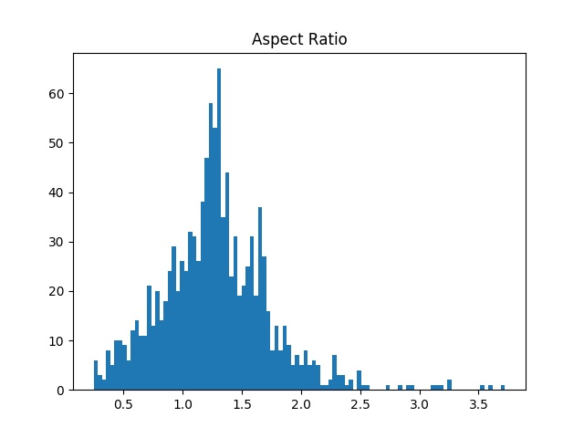

# line_remover

A project using CNNs to remove ruled lines from sketches

## Raw Data

There are 1124 sketches in the 'Sketches' directory. (Some files appear to be corrupt, will need to ivnestigate this.)

The histograms below show the heights, widths and aspect ratios of these images.

Based on these measurements, all images will be resized to a standard size of height = 4000, width = 3200 pixels, or some multiple of these dimensions (i.e., 400 x 320, 800 x 640, etc)

This will be done by first determining the aspect ratio for each image. If the aspect ratio is greater than 1.25 (height/width), the image will be resized to 4000 pixels high and something less than 3200 pixels wide. It will then be padded on the sides to fill to 3200 pixel width.

If the aspect ratio is less than 1.25, the image will be resized to 3200 pixels wide and the corresponding height. It will then be padded top and bottom to a height of 4000 pixels.

## Image Color Format

Because the sketches are in charcoal and essentailly grayscale, I thought it would make sense to use the LAB image format. In this format, the first channel, Lightness, encodes the most signficant information about the sketch. The remaining two channels provide some color shading information. Because there is relatively little color shading, this channels are less important.

I also thought it would speed up the training process if I pre-processed all the images into standard size and format. I used the PIL Image and the skimage color modules to convert the images to numpy arrays in LAB color format, all padded to an aspect ratio of 1.25. However, I found that this resulted in very, very large files.

In the interest of keeping smaller files and faster training time, I decided to change the approach to using a pure grayscale image format for training. Because the images are charcoal sketches with very little color variation converting them to 'L' color format should preserve nearly all of the image information. This reduces the data from three dimensions to two, which makes for smaller files and much faster training. Once the model is fully trained in grayscale, an image can be decomposed into its three color components and each color channel can be individually transformed (i.e, have the ruled lines removed), and then the final image can be built from the combination of the three channels.
